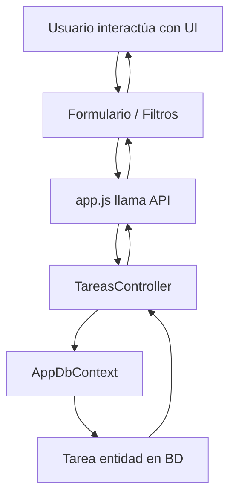

# 📄 Documentación: CRM Ventas - Gestión de Tareas

## 📦 Arquitectura General

El proyecto está compuesto por tres capas principales:

1. **API Backend (ASP.NET Core)**

   * Gestiona la lógica de negocio y persistencia de tareas.
   * Implementa operaciones CRUD sobre la entidad `Tarea`.

2. **Modelo de Datos (Entity Framework Core)**

   * Definición de entidades y propiedades.
   * Relación con oportunidades (`OportunidadId`).

3. **Frontend (HTML + JavaScript con Axios)**

   * Interfaz de usuario para crear, filtrar, actualizar y eliminar tareas.
   * Comunicación con la API mediante solicitudes HTTP.

---

## 🏷 Clases Principales

### 1️⃣ `Tarea` (Modelo)

```csharp
public class Tarea
{
    public int Id { get; set; }
    public string Titulo { get; set; } = string.Empty;
    public string Descripcion { get; set; } = string.Empty;
    public int OportunidadId { get; set; }
    public string EstadoOportunidad { get; set; } = "Pendiente";
    public string VendedorAsignado { get; set; } = string.Empty;
    public string EstadoTarea { get; set; } = "Pendiente";
    public DateTime FechaCreacion { get; set; } = DateTime.Now;
    public DateTime? FechaFinalizacion { get; set; }
    public string UsuarioUltimaActualizacion { get; set; } = string.Empty;
    public DateTime UltimaActualizacion { get; set; } = DateTime.Now;
}
```

**Descripción:**

* Representa una tarea dentro del CRM.
* Mantiene información de progreso, asignación y auditoría.
* `OportunidadId` indica a qué oportunidad comercial pertenece la tarea.

**Relaciones UML:**

* `Tarea` 1..\* → `Oportunidad`.

---

### 2️⃣ `TareasController` (API Controller)

```csharp
[ApiController]
[Route("api/[controller]")]
public class TareasController : ControllerBase
{
    private readonly AppDbContext _context;
    
    public TareasController(AppDbContext context)
    {
        _context = context;
    }
    // Métodos CRUD y operaciones adicionales
}
```

#### Métodos Principales

| Método                                      | Ruta                            | Descripción                                                       | Retorno                  |
| ------------------------------------------- | ------------------------------- | ----------------------------------------------------------------- | ------------------------ |
| `GetAll()`                                  | `GET api/Tareas`                | Obtiene todas las tareas                                          | `List<Tarea>`            |
| `GetById(int id)`                           | `GET api/Tareas/{id}`           | Obtiene una tarea específica                                      | `Tarea` o `NotFound`     |
| `Create(Tarea tarea)`                       | `POST api/Tareas`               | Crea una nueva tarea                                              | `Tarea` creada con ID    |
| `Update(int id, Tarea tarea)`               | `PUT api/Tareas/{id}`           | Actualiza datos o estado de la tarea                              | `NoContent` o `NotFound` |
| `Delete(int id)`                            | `DELETE api/Tareas/{id}`        | Elimina una tarea                                                 | `Ok` o `NotFound`        |
| `AsignarVendedor(int id, string vendedor)`  | `POST api/Tareas/{id}/asignar`  | Asigna un vendedor a la tarea                                     | `Tarea` actualizada      |
| `ActualizarProgreso(int id, string estado)` | `POST api/Tareas/{id}/progreso` | Actualiza estado de la tarea (Pendiente, En Progreso, Completada) | `Tarea` actualizada      |

**Notas UML:**

* `TareasController` depende de `AppDbContext`.
* Métodos son asincrónicos (`async Task<ActionResult>`).
* Incluye operaciones CRUD y funcionalidades extendidas.

---

## 🖥 Frontend

### Archivos Principales

1. **HTML (`index.html`)**

   * Formulario de creación de tareas.
   * Filtros por vendedor, estado de tarea y estado de oportunidad.
   * Contenedor de tarjetas de tareas.

2. **JavaScript (`app.js`)**

   * Comunicación con la API mediante Axios.
   * Funciones principales:

     * `fetchTareas()` → carga tareas y oportunidades.
     * `renderTareas(tareas)` → genera tarjetas dinámicas.
     * `llenarSelects()` → llena selectores y autocompleta campos.
     * `crearBtn.addEventListener` → crea nueva tarea.
     * Filtros (`aplicarFiltroBtn`, `limpiarFiltroBtn`) y cambios de estado (`cambiarEstado`).
     * Eliminación de tareas (`eliminarTarea`).

**Relaciones de flujo:**

* `app.js` → llama endpoints de `TareasController`.
* `TareasController` → interactúa con `AppDbContext` → `Tarea`.

---

## 🔗 Flujo General de la Aplicación



**Descripción:**

1. Usuario crea o filtra tareas desde la UI.
2. JS envía solicitud HTTP a API.
3. Controller maneja lógica y persiste cambios en la base de datos.
4. Resultado se renderiza dinámicamente en la UI.

---

## 📌 Consideraciones

* **Estado de tarea:** Pendiente, En Progreso, Completada.
* **Asignación de vendedor:** opcional, basada en oportunidad.
* **Auditoría:** siempre se registra `UltimaActualizacion`.
* **Validaciones:** frontend y backend (campos obligatorios y existencia de tarea).
